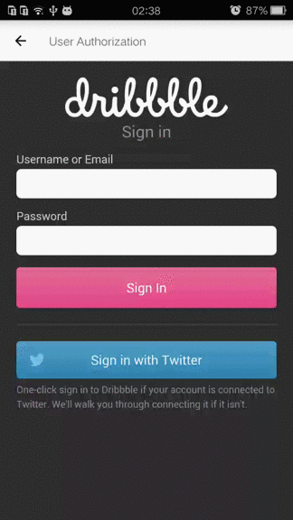
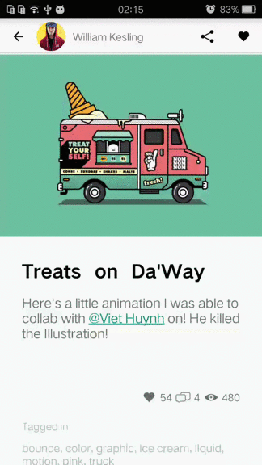
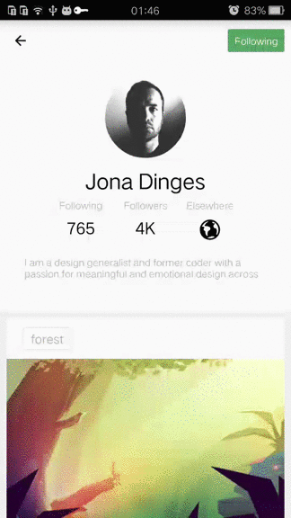
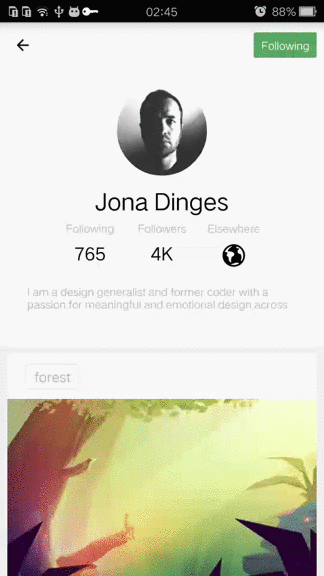
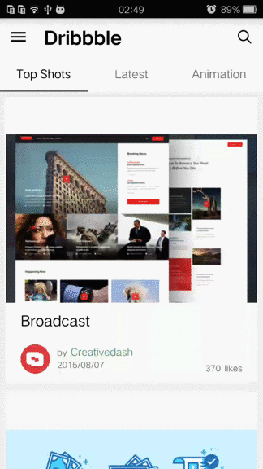

##What is this?
This is a project with custom client app on android for <https://dribbble.com>, which you can browse the popular icon and animation, like the shot, check the author of the shot, follow them and so on. This is a easy-use app for you to check the recent shots on dribbble everywhere. And the style of app is inspired by [medium](https://play.google.com/store/apps/details?id=com.medium.reader).  

##What you can do with this project?
This is a simple example about how to set up a client for a website through OAuth. You can read the code and try to set up a client for another service by yourself. Hope this can help you :)

##Apk
You can download the apk at [this](app/app-release.apk)

##Demo
####User authorization####

####Home Page####

####Shot detail and comments####

####Author page

####Following

####Drawer navigation

##Used library
* [Fresco](https://github.com/facebook/fresco)
* [Volley](https://github.com/mcxiaoke/android-volley)

##License
MIT
##Extra
If you can provide me a android job in shanghai, I will appreciate it.
